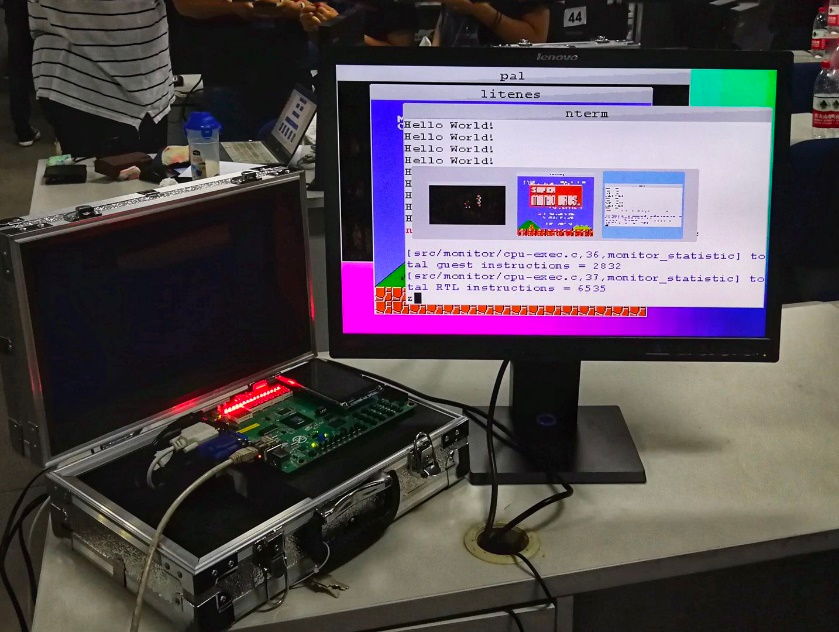

# AbstractMachine: 抽象计算机

AbstractMachine 是裸机上的 C 语言运行环境，提供 5 组 (15 个) 主要 API，可以实现各类系统软件 (如操作系统)：

* (TRM: Turing Machine) `putch`/`halt` - 最基础的计算、显示和停机
* (IOE: I/O Extension) `ioe_read/ioe_write` - I/O 设备管理
* (CTE: Context Extension) `ienabled`/`iset`/`yield`/`kcontext` - 中断和异常
* (VME: Virtual Memory Extension) `protect`/`unprotect`/`map`/`ucontext` - 虚存管理
* (MPE: Multi-Processor Extension) `cpu_count`/`cpu_current`/`atomic_xchg` - 多处理器

---

* AbstractMachine 简介
  * [如何为 “裸机” (bare-metal) 编程](https://jyywiki.cn/AbstractMachine/AM_Programs.html)
  * [在 AbstractMachine 上封装库函数](https://jyywiki.cn/AbstractMachine/AM_klib.html)
* 规约与文档
  * [AbstractMachine 设计概述](https://jyywiki.cn/AbstractMachine/AM_Design.html)
  * [AbstractMachine 规约 (Specifications)](https://jyywiki.cn/AbstractMachine/AM_Spec.html)
  * [AbstractMachine 设备规约](https://jyywiki.cn/AbstractMachine/AM_Devices.html)
