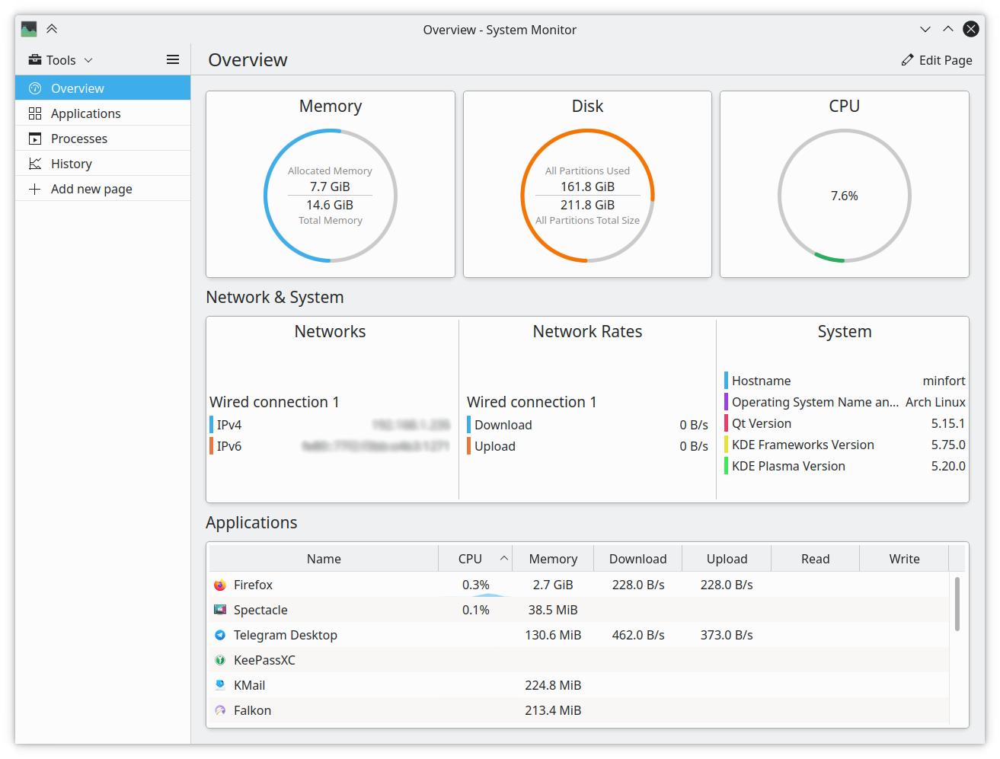

# M1: 打印进程树 (pstree)

> #### ⏰ 截止日期
>
> **Soft Deadline: 2023 年 3 月 19 日 23:59:59。**
>
> 你需要首先阅读[实验须知](https://jyywiki.cn/OS/2023/labs/Labs.html)，其中包含了代码获取方法、提交方法、如何查看提交结果等。
>
> 在命令行中 `git pull origin M1` 下载框架代码。

> #### ⚠️ 学术诚信
>
> 正如课堂上所说，主动 “参考” 他人的代码、使用他人测试用例都是不严格要求自己的行为。为了使你变得更强，遵守学术诚信可以使你获得真正的训练。坚信 **计算机世界里没有玄学** ，无论是 C 代码、汇编代码还是处理器，都可以看作是严格的数学对象，可以使你在遇到问题时少一些焦躁，冷静下来分析下一步应该做什么。
>
> 具体到这个实验，你应当主动地避免阅读任何人 (包括互联网) 上打印进程树或进程列表的代码，但可以查看 API (如 readdir 等) 的使用方法和例程。遇到问题时尽量自己调试解决，但可以向他人请教调试的技巧，例如 “我遇到了 XX 现象”，但不知道下一步应该怎么做。
>
> 为了确保你对操作系统有真实的了解， **本课程禁止直接使用 AI 生成的代码和直接复制互联网上的代码** 。你应当主动不要求 AI 写代码或从互联网上复制代码，但你可以询问 AI 或在互联网上搜索 API 的使用方法。

OS2023-M1 提交结果

## 1. 背景

因为程序可以看成状态机，操作系统能 “同时运行多个程序” 的能力就是状态机管理的能力。自然，操作系统也应该提供 “监测状态机状态” 的功能，例如显示在一段时间内，各个程序 (进程、状态机) 的活跃程度。没错，这就是大家熟悉的[任务管理器](https://www.cyberciti.biz/tips/top-linux-monitoring-tools.html)。下面的图片展示了 Plasma Desktop 的任务管理器，能够显示系统资源的使用情况和进程的信息。



我们只要能实现获取进程列表、进程占用 CPU 内存信息等，是不是我们也可以实现类似的功能呢？根据《操作系统》课程重要的基本原理 **合理的需求一定有合适的方法满足** ，操作系统一定会提供进程相关的对象和获取信息的 API。如果你是操作系统的设计者，你会提供怎样的 API (syscall)？

一个可行的想法是操作系统可以提供类似迭代器的 API，可以在某个时刻对进程列表进行 “快照”，然后程序可以通过 API 迭代快照里的进程。

```
Snapshot*CreateProcessSnapshot();// 迭代开始
Process*FirstProcess(Snapshot*snapshot);// 取得第一个进程
Process*NextProcess(Process*process);// 获得下一个进程
intReleaseProcessSnapshot(Snapshot*snapshot);// 迭代结束
```

高级语言可以进一步封装，例如借助 WMI (Windows Management Instrumentation) 库：

```
import wmi
for proc in wmi.WMI().Win32_Process():
    ...
```

UNIX 操作系统的设计者用另一种方法使应用程序能访问进程列表：操作系统会不断更新一个对象 (文本文件) 的内容，这样应用程序就能用文件 API (open, read, close) 来获取进程列表，例如大家可以用熟悉的 C 语言 `FILE *` 访问。例如，今天我们可以考虑一个名为 `/system/processes.json` 的文本，每当进程创建或退出，这个文件的内容就会更新：

```
[
{
"pid":1,
"parent":-1,
"command":"/bin/init"
},
{
"pid":2,
"parent":1,
"command":"/bin/bash"
}
]
```

UNIX 采用了 Everything is a File 的设计。换句话说，我们可以 **把操作系统的状态变成文件系统的一部分** ，从而可以使用我们熟悉的 read, write 等 API 访问操作系统中的各类信息。在这个实验中，我们学习 UNIX/Linux 是如何把操作系统的状态放在文件系统中的。虽然这个实验里你只需要读取进程列表和进程之间的父子关系，但用类似的办法，也可以从 Linux 系统中读取出 CPU 占用率、内存使用等信息——于是你也可以实现自己的任务管理器了！

> #### ❓ 思考题
>
> **优点和缺点**
>
> Everything is a file 和提供 type-safe 的 API 都不是完美的。前者对人类用户来说更好用，例如可以用 UNIX 命令行工具任意解析而不需要写代码，但带来很多 “隐藏的规约”；后者把规约写在 API 里，可以在你犯错时更好地保护你，但 “上手” 也稍稍困难一些：Windows Kernel + GDI 的 Windows API 就在 1,000 个以上。
>
> 我们预见到大语言模型和程序合成 (“低代码”) 技术能够从根本上改变我们开发的方式，操作系统 API 会逐渐成为一种只有库函数使用的 “汇编语言”。

## 2. 实验描述

> #### 实验要求
>
> **实现 `pstree` 打印进程之间的树状的父子关系**
>
> Linux 系统中可以同时运行多个程序。运行的程序称为 **进程** 。除了所有进程的根之外，每个进程都有它唯一的父进程，你的任务就是把这棵树在命令行中输出。你可以自由选择展示树的方式 (例如使用缩进表示父子关系，这是最容易的)。

Linux 系统自带了 `pstree` 命令，进程树会以非常漂亮的格式排版 (每个进程的第一个孩子都与它处在同一行，之后的孩子保持相同的缩进)：

```
systemd─┬─accounts-daemon─┬─{gdbus}
        │                 └─{gmain}
        ├─acpid
        ├─agetty
        ├─atd
        ├─cron
        ├─dbus-daemon
        ├─dhclient
        ├─2*[iscsid]
        ├─lvmetad
        ├─lxcfs───10*[{lxcfs}]
        ├─mdadm
        ├─polkitd─┬─{gdbus}
        │         └─{gmain}
        ├─rsyslogd─┬─{in:imklog}
        │          ├─{in:imuxsock}
        │          └─{rs:main Q:Reg}
        ...
```

Linux 的 psmisc 中 `pstree` 的实现大约有 1,300 行，支持多种命令行参数。这个实验里实现最简单的就行。大家可以先玩一下 Linux 的 `pstree`，使用 `man` 命令查看 `pstree` 支持的功能，并试一试。在这个实验中，我们需要实现它的简化版：

### 2.1 总览

pstree [OPTION]…### 2.2 描述

把系统中的进程按照父亲-孩子的树状结构打印到终端。

* `-p` 或 `--show-pids`: 打印每个进程的进程号。
* `-n` 或 `--numeric-sort`: 按照pid的数值从小到大顺序输出一个进程的直接孩子。
* `-V` 或 `--version`: 打印版本信息。

你可以在命令行中观察系统的 `pstree` 的执行行为 (如执行 `pstree -V`、`pstree --show-pids` 等)。这些参数可能任意组合，但你不需要处理单字母参数合并的情况，例如 `-np`。

### 2.3 解释

上述实验要求描述是参照 man page 的格式写出的，其中有很多 UNIX 命令行工具遵守的共同约定 (UNIX 的资深用户对此了如指掌；但对给初学者，尤其是从出生以来就生活在 GUI 环境中而不是遇事就读手册的大家造成了很大的困扰)，例如 [POSIX 对命令行参数有一定的约定](http://pubs.opengroup.org/onlinepubs/9699919799/basedefs/V1_chap12.html)，**读完以后，你立即发现你对手册的理解增加了** (手册的格式竟然也是 POSIX 标准的一部分！)：

1. 中括号扩起的参数是可选参数，`[]` 后的 `…` 代表参数的 0 次或多次重复。因此 `-p`, `-n`, `-V` 都是可选的参数。
2. 同一个选项可以有不同的名字。在 `pstree` 中，`-p` 和 `--show-pids` 的含义是一样的。
3. 若不另行说明，整数范围在 32 位有符号整数范围内；但如果数值和文件大小有关，则其合法的范围是是 0 到系统最大支持的文件大小。

此外，`main` 函数的返回值代表了命令执行的状态，其中 `EXIT_SUCCESS` 表示命令执行成功，`EXIT_FAILURE` 表示执行失败。对于 POSIX 来说，0 代表成功，非 0 代表失败：例如 `diff` 返回 1 表示比较的文件不同，返回 2 表示读取文件失败 (`cmp` 的行为也类似)。UNIX Shell 对返回值有[额外的处理](http://pubs.opengroup.org/onlinepubs/9699919799/basedefs/V1_chap12.html)。这解释了为什么一些 OJ 会明确要求 main 函数返回值为 0，当返回非 0 时将被认为是 Runtime Error。

> #### Specification
>
> ** Online Judge 对返回值的要求**
>
> 按照 UNIX 惯例，`main` 函数返回非 0 将在 Online Judge 中被判定为 Runtime Error。

 **如果不知道这些约定，使用 Linux/Unix 的时候就会举步维艰。Unix 世界有一套自己定义的 “游戏规则”。** 也难怪会有笑话：

> Unix is *user-friendly* — it's just choosy about who its friends are.

当然，在渐渐熟悉游戏规则以后就会发现，这套设计在 1970 年代有限的计算机算力和使用者的负担之间达成了优雅的平衡——Shell 总是可以帮助你用最短的时间把 quick and dirty 的事情搞定：UNIX 哲学强调 *Keep it simple, stupid* 和  *Everything is a file* .

## 3. 正确性标准

你可以任意选择树的形态，以下输出都是合法的：

```
$ ./pstree-64
systemd─┬─accounts-daemon─┬─
        │
        ...

$ ./pstree-64
systemd
 |
 +--accounts-daemon-
 |
 ...

$ ./pstree-64
systemd
  accounts-daemon
    ...
```

只要输出系统中的进程即可；此外，允许进程列表有轻微出入。细心的同学可能发现你第一个版本的 `pstree` 可能和系统输出不太一样。在线评测会容忍你输出的一些缺陷；此外，作为第一个实验，我们会手下留情，没有非常强劲的测试数据。但你仍然需要确保：

1. 正确列出系统中的进程，并正确实现参数组合的行为；
2. 编写可移植的代码。我们会同时测试 32-bit 和 64-bit 的版本。

> #### 提示
>
> **在 Hard Test 上 Wrong Answer？**
>
> 试一试 `pstree -V > /dev/null`，你会发现输出并没有到 `/dev/null`。我们希望你的行为和系统中的 `pstree -V` 基本一致：输出到正确的输出流、包含 `pstree` 的基本信息，但版本描述可以不同。

## 4. 实验指南：把大象装进冰箱

> #### 想自己尝试？
>
> 鼓励大家忽略下面的教程，自己动手搞定，遇到不明白的地方可以求助 Google (Bing, Stackoverflow, ...)。完成之后可以看一下实验指南，看自己的理解是否有可以改进的空间。

* “把大象放进冰箱总共分几步？” “三步，第一步把冰箱门打开；第二步把大象放进去，第三步把冰箱门带上。” — 赵本山、宋丹丹《钟点工》

如果你觉得打印进程树这个问题比较困难，我们也把问题分解一下：

1. 得到命令行的参数，根据要求设置标志变量的数值；
2. 得到系统中所有进程的编号 (每个进程都会有唯一的编号) 保存到列表里；
3. 对列表里的每个编号，得到它的的父亲是谁；
4. 在内存中把树建好，按命令行参数要求排序；
5. 把树打印到终端上。

因为人的脑容量有限，通常解决问题的办法就是把比较复杂的问题分解成小问题，再把小问题继续分解下去。而在学校里所做的训练就是 **建立问题分解的思路和培养解决问题的能力** 。

### 4.1. 命令行参数

我们的框架中已经包含了以下代码，功能是输出为 main 函数传递的参数——把进程看作状态机，main 函数的参数是进程 “初始状态” 的一部分，它是由进程的创建者决定的，也就是你在终端中执行类似 “`./a.out hello world`” 时指定的。

```
#include<stdio.h>
#include<assert.h>

intmain(intargc,char*argv[]){
for(inti=0;i<argc;i++){
assert(argv[i]);// C 标准保证
printf("argv[%d] = %s\n",i,argv[i]);
}
assert(!argv[argc]);// C 标准保证
return0;
}
```

首先，尝试编译运行这个程序，并且这个程序传入不同，并且观察程序的输出。你会确认 `argv[0], ..., argv[argc-1]` 就是所有命令行的参数，这是操作系统与 C 程序之间的约定。getopt (`man 3 getopt`) 库可以处理命令行参数；当然，你也可以直接自己动手解析。

### 4.2. 开始做实验

之后会反复编译运行这个程序，所以**编译和测试自动化**非常重要。比较常见的项目组织是编写 Makefile，在命令行中使用 `make` 实现编译，`make test` 完成测试。我们已经为大家提供了 Makefile，欢迎大家仔细阅读。IDE 和编辑器 (例如 vscode) 都支持运行和调试的配置。我们强烈建议同学们在你们熟悉的编程环境中完成编译运行的配置，以最大化你的编程效率。

> #### 提示
>
> 回想一下大家做 OJ 题的过程。在编程的过程中，难免会经历修改代码 →**→** 编译 →**→** 运行 →**→** 修改代码……这样的循环。你会选择怎么做呢？新手每次都键入命令 (或者他发现 Ctrl-p 可以重复命令)。
>
> * 之后，有同学人发现，可以把命令写在一行里，比如 `gcc a.c && ./a.out`，一键就能编译运行了。
> * 再之后会发现可以写个 Makefile (就像这个实验一样)，用 `make test` 跑完所有测试。
> * 再之后会发现可以每次在文件改动以后自动运行所有测试……有个神奇的命令叫 `inotifywait`。
>
> 即便现在有 IDE 和丰富的插件，UNIX 哲学依然是无处不在的 (甚至是这些 IDE 的组成基础)，说得更具体一点，“只要你敢想，就一定能做到”。祝大家编程愉快。
>
> 最后，以下两点有助于调试时放平心态：(1)  **机器永远是对的** ；(2)  **未测代码永远是错的** 。

### 4.3. 得到系统中进程的编号

进程是操作系统中的对象，因此操作系统一定提供了 API 访问它们。已经剧透过，系统里的 **每个进程都有唯一的编号** ，它在 C 语言中的类型是 `pid_t`。不知道这是什么？Google 一把就知道啦。你能找到 glibc 对它的[官方文档解释](https://www.gnu.org/software/libc/manual/html_node/Process-Identification.html)。以后遇到问题要自己找答案哦！

操作系统以什么样的方式让你获取系统里的进程呢？之前也提示过：

> Everything is a file.

一切皆文件，进程信息当然也可以是 “一切” 的一部分。Linux 提供了 [procfs](https://en.wikipedia.org/wiki/Procfs)，目录是 `/proc`。如果你进去看一眼，就会发现除了一些比如 `cpuinfo` 这样的文件，还有很多以数字命名的目录——聪明的你也许已经猜到了，每个目录的名字就是进程号，目录里存储了进程相关的运行时数据。

我们鼓励大家先玩一玩 procfs，里面可有很多有趣的东西！你可以用 `cat` 可以打印文件的内容，对照文档 (或者 ChatGPT)，你会发现原来我们以为离我们很遥远的 “观测进程执行”，简单得只要解析文本文件就可以了！例如，每个进程的父进程也隐藏在 `/proc/[pid]/` 中的某个文件里。试试 `man 5 proc`，里面有详细的文档。很多 Online Judge 都使用 procfs 读取进程的运行时间/内存数据。

### 4.3. 遍历所有进程

了解了 procfs 之后，我们的问题就变得简单一些了：只要能得到 `/proc` 目录下的所有以数字为开头的目录，我们就遍历了系统中的进程。因此你会去互联网上搜索如何用 C 语言遍历目录。之后，你可以用你熟悉的方式打开 procfs 里的文件：

```
FILE*fp=fopen(filename,"r");
if(fp){
// 用fscanf, fgets等函数读取
fclose(fp);
}else{
// 错误处理
}
```

procfs 里的信息足够让你写一个非常不错的任务管理器。那么，“真正” 的任务管理器，例如 ps 命令，是否也是基于 procfs 实现的呢？这就是一个典型的 “好问题”：他帮助你建立你的实验作业和真实系统之间的联系。操作系统课程也给了大家足够的工具，使得同学们可以把任务管理器打开，查看它调用的操作系统 API。我们在课堂上已经演示过 gcc 和 xedit 的例子，就用 strace 工具就能查看进程运行时的系统调用序列：

```
$ strace ps
...
openat(AT_FDCWD, "/proc/1/stat", O_RDONLY)           = 6
read(6, "1 (systemd) S 0 1 1 0 -1 4194560"..., 1024) = 190
close(6)                                             = 0
...
```

### 4.4. 建树和打印

这是算法/数据结构课程的内容，也是经典的编程面试题之一——互联网公司很可能会用类似的题目来考察面试者的基本能力。如果你没有头绪，试着定义一个递归函数 �(�)=[�1,�2,…,��]**f**(**T**)**=**[**s**1****,**s**2****,**…**,**s**n****] 把 �**T** 打印成多行文本 (第 �**i** 行是字符串 ��**s**i****)。

1. 对于叶子节点，直接输出一个格式化字符串 (例如使用 `asprintf`)；
2. 如果不是叶子节点，对它所有子树 �1,�2,…��**T**1,**T**2,**…**T**k** 分别求 ��(��)**f**i(**T**i)，得到 �**k** 个多行的文本；
3. 把这些字符串拼到适当的位置，加上一些连接线：

```
(root)─+─T1(line 1)
       | T1(line 2)
       | T1(line 3)
       +─T2(1)
       |
...
```

然后你会发现你并不需要真的实现 �(�)**f**(**T**)，而是一遍递归一边打印就行。

### 4.5. 写出正确的代码

> #### 完成了？
>
> 是时候问问自己：我的程序对吗？

虽然在这个实验里，我们的测试用例相对简单；但在未来的实验中，Online Judge 可能会在各种奇葩的条件下运行你的程序哦！除了你们做的 OJ 题中会有复杂的逻辑 (参数的组合) 导致 bug 之外，和系统打交道的编程可有更多的麻烦之处：

1. 你的程序遵守 POSIX 的返回值规定吗？如果你的 main 函数返回了非 0 的数值，我们将认为程序报告了错误——在非法的输入上返回 0，以及在合法的输入上返回非 0 都将导致 Wrong Answer。
2. 程序够 roubust 吗？它会不会在一些非法的输入上 crash？如果系统里的进程很多呢？如果内存不够了呢？如果 `open` 或者 `malloc` 失败了呢？要知道，crash 一般是因为 [undefined behavior (UB)](https://en.wikipedia.org/wiki/Undefined_behavior) 导致的——UB 没把所有的文件都删掉真是谢天谢地了。
3. 万一我得到进程号以后，进去发现文件没了 (进程终止了)，怎么办？会不会有这种情况？万一有我的程序会不会 crash……？
4. 进程的信息一直在变，文件的内容也一直在变 (两次 `cat` 的结果不同)。那我会不会读到不一致的信息(前一半是旧信息、新一半是新信息)？这两个问题都是 race condition 导致的；我们将会在并发部分回到这个话题。
5. 如果我不确信这些事会不会发生，我有没有写一个程序，至少在压力环境下测试一下它们有没有可能发生？嗯，如果我同时运行很多程序，每个程序都不断扫描目录、读取文件，也观察不到这个问题，至少应该可以放点心。

随着课程的深入，这些问题都会得到解答。

当你的程序越来越复杂，这些问题也许将会成为你挥之不去的阴影。这就对了——从 Intel 的 CPU 到 Linux Kernel 都有数不清的 bug。你也许听说过 “形式化验证”，但事实也证明，经过验证正确的编译器 (CertComp) 和操作系统 (seL4, FSCQ, ...) 都依然存在 bug，尽管它们的可靠性依然比程序员手写的高得多。

写出正确的代码远比想象中困难——目前地球上还没人能保证复杂的系统没有 bug 和漏洞。我个人热切盼望着没有 bug 的那一天的到来，不过似乎遥不可及。不过也不用太绝望，这门课里会教给大家一些有关 “写代码” 的知识，更重要的是正确的思维方式 (“世界观”)：操作系统会提供什么、该提供什么、不该提供什么、应该怎么提供。
