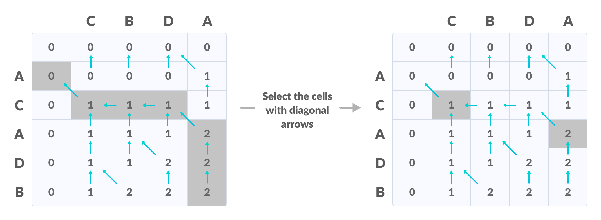

# M2: 并行 Longest Common Subsequence (plcs)

> #### ⏰ 截止日期
>
> **Soft Deadline: 2023 年 4 月 3 日 23:59:59。** (因机房断电延迟到 4.3)
>
> 你需要首先阅读[实验须知](https://jyywiki.cn/OS/2023/labs/Labs.html)，其中包含了代码获取方法、提交方法、如何查看提交结果等。
>
> 在命令行中** **`git pull origin M2` 下载框架代码。

> #### ⚠️ 学术诚信
>
> 正如课堂上所说，主动 “参考” 他人的代码、使用他人测试用例都是不严格要求自己的行为。为了使你变得更强，遵守学术诚信可以使你获得真正的训练。坚信 **计算机世界里没有玄学** ，无论是 C 代码、汇编代码还是处理器，都可以看作是严格的数学对象，可以使你在遇到问题时少一些焦躁，冷静下来分析下一步应该做什么。
>
> 具体到这个实验，你应当主动地避免阅读任何人 (包括互联网) 上打印进程树或进程列表的代码，但可以查看 API (如 readdir 等) 的使用方法和例程。遇到问题时尽量自己调试解决，但可以向他人请教调试的技巧，例如 “我遇到了 XX 现象”，但不知道下一步应该怎么做。
>
> 为了确保你对操作系统有真实的了解， **本课程禁止直接使用 AI 生成的代码和直接复制互联网上的代码** 。你应当主动不要求 AI 写代码或从互联网上复制代码，但你可以询问 AI 或在互联网上搜索 API 的使用方法。

OS2023-M2 提交结果

## 1. 背景

“最长公共子序列” (Longest Common Subsequence, LCS) 是大家熟悉的算法问题，问题的定义如下：

给定两个字符串 $A$ *和 $B$，现在允许从 $A$* 和$B$ 中分别删除任意数量的字符，但字符的出现的顺序不能改变，得到字符串$A′$ **和** $B′$。问如何删除，使得：

* $C=A′=B′$**，即删除剩下的字符串相同，$C$** 被称为$A$和$B$的一个 “公共子序列”；
* $∣C∣$即公共子序列的长度最大。

以下是一些例子：

* `LCS("abcde", "ace") = 3`, LCS 为 `ace`
* `LCS("bcdaacd", "acdbac") = 4`, LCS 为 `cdac`
* `LCS("abc", "def") = 0`

LCS 是一个十分经典的算法问题，也是 “动态规划” 算法的典型代表。大家可以在互联网上查找 LCS 问题的[求解方法](https://www.geeksforgeeks.org/longest-common-subsequence-dp-4/)；或是在互联网上寻找讲解最长公共子序列的视频教程。

## 2. 实验描述

我们发现互联网上广泛流传的算法并不能有效地利用多处理器并行计算的能力。在这个实验中，我们已经提供了一个单线程的 LCS 算法实现。你需要将它并行化，使它能利用多处理器并行的计算力加速计算。注意：存在一些算法 trick 能加速 LCS 的计算，但我们的要求是将我们给出的 naive 动态规划算法并行化。

### 2.1. 总览

$plcs [T]$

### 2.2. 描述

创建$T (T≤16)$ 个线程求解字符串的最长公共子序列。plcs 命令从标准输入中读取两个字符串，并将 LCS 的长度输出到标准输出。我们保证输入字符串的长度均不超过 10,000。

当不提供参数$T$时，$T=1$，即串行求解。

### 2.3. 解释

框架代码中已经包含了串行 LCS 的实现，它的功能是正确的 (创建了多个线程，但不能并行求解)。你在并行化的过程中，需要遵守以下约定：

* 你不能创建超过$T$个线程 (`main` 所在的线程不计入，因此你可以利用 `main` 线程)
* 你只能使用纯粹的计算和给出的框架代码 thread.h/thread-sync.h 中提供的 API (其中包括 lock 和 unlock)

请特别注意：lock/unlock 只能保护和其他 lock/unlock 代码之间的互斥；持有锁的线程仍然会和其他不使用 lock/unlock 的代码在多个处理器上并行执行。此时，访问共享内存 (至少有一个是写) 将导致数据竞争，这是一种很常见的并发 bug。

## 3. 正确性标准

首先，你的程序仍然应该能够正确输出最长公共子串 LCS 的数值。

其次，你不应该大幅修改我们给出的算法，因此，我们预期在$T=1$时，你的代码的运行时间与框架代码相当。

在此基础上，我们需要观测到在字符串的长度足够大 (如 10,000) 时，你的代码在一个多处理器 (不少于 4 个处理器) 的 Online Judge 评测机上，$T=1,2,4$时接近于$T$ 倍的线性加速。

## 4. 实验指南

### 4.1. 寻找并行的机会

我们可以把 LCS 的动态规划算法 (无论是递归求解，还是迭代求解) 都看成是一个有向无环图上的计算：为了得到$f(i,j)$的值，我们就需要$f(i−1,j) f(i−1,j)$**和** $f(i−1,j−1)$的值。只有在这三个值都被正确计算的前提下，我们才能正确计算$f(i,j)$：



很自然地，我们选择用任何 “计算图” 上的拓扑序计算，就可以保证每个节点计算时，它需要的数据都已经准备好，于是有了框架代码中的二重循环，它代表了一种拓扑顺序：

```c
for(int i=0; i<N; i++){
  for(int j=0; j<M; j++){
    // Always try to make DP code more readable
    int skip_a = DP(i-1,j);
    int skip_b = DP(i,j-1);
    int take_both = DP(i-1,j-1) + (A[i]==B[j]);
    dp[i][j] = MAX3(skip_a,skip_b,take_both);
  }
}
```

然而，里层循环却不能被直接并行：当$i$**固定时，计算** $f(i,j)$需要 $f(i,j−1)$的值。那么，应该按照什么样的顺序计算呢？不妨把矩形旋转 45 度——你会发现，我们可以在$2n−1$“步” 之内计算完所有节点上的数值，而每一步里的节点都是可以并行计算的：


在这张图中，只要红线 “上面” 的$f(i,j)$都被正确计算出来，红线上的$f(i,j)$就可以并行计算。当字符串长度足够时，每个线程就可以分配到足够的工作量了。

### 4.2. 并行算法设计原理

如果我们把每个节点看作是消耗时长大致相等的计算、把边看成是节点计算的依赖关系，我们就得到了计算的依赖图 (dependency graph)。计算图的深度决定了并行算法的时间下限——任何一条长度为$d$的路径都意味着我们需要至少$d$步的串行计算。而在每个节点的计算时间远远大于线程调度/同步开销时，假设$Tn$是$n$个处理器执行的最优时间，那么有 Brent's Theorem:  $T1/p ≤ Tp ≤ T1/p + T∞.$

由于$T∞$则可以通过在计算依赖图上立即并行执行一切可执行的计算实现，这个结论意味着我们几乎总是可以并行 “可并行” 的部分。在实际并行化程序时，我们可以把计算图分成若干轮次的迭代 (例如 LCS 中，根据对角线划分迭代的轮次)，在每一个轮次中，均匀地把任务分配给各个线程执行。

### 4.3. 实现并行求解

在理解了并行算法的设计原理以后，实现并行 LCS 就不困难了：

```c
for(int round=0; round < 2*n-1; round++){
  // 1. 计算出本轮能够计算的单元格
  // 2. 将任务分配给线程执行
  // 3. 等待线程执行完毕
}
```

上面的代码框架可以使用同步，也可以使用互斥实现。另外值得一提的是，当本轮计算量足够小时，并行化带来的收益未必划算 (执行额外同步操作的时间可能和直接串行执行相差无几)。此外，缓存访问的局部性也是并行化算法的一个重要考虑。这部分内容交给大家自由探索。
