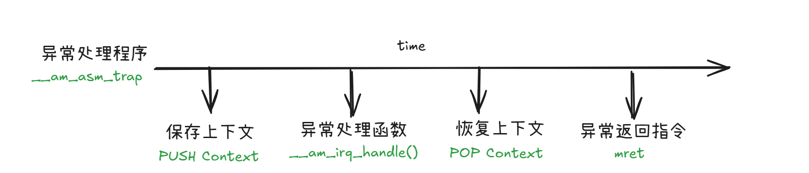
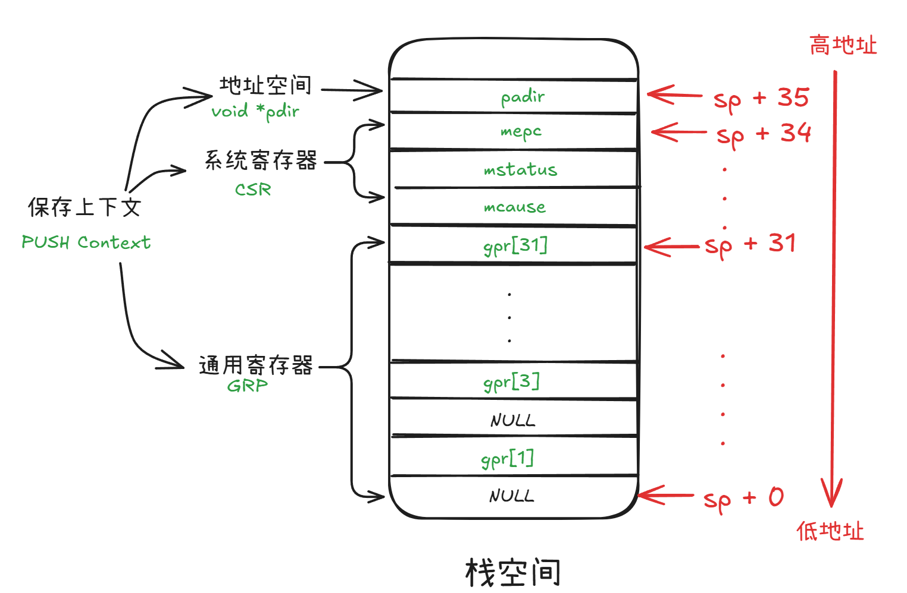
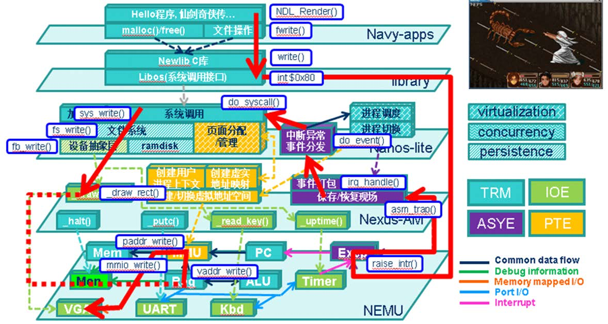

# ICS2023


摘抄自： https://raw.githubusercontent.com/TonyCrane/note/master/docs/cs/system/pa.md
整个实验逐步引导完成一个计算机系统的构建，包括底层的 NEMU 模拟器，运行时环境 AbstractMachine（AM），在其上的简易操作系统 NanOS-lite，以及操作系统上的应用程序库 Navy-apps。
一共分为 5 个部分，PA0 配置环境，PA1 完善 NEMU 的调试器功能，PA2 模拟 NEMU 指令运行以及补充 AM，PA3 完善 NEMU 的中断/异常处理、实现操作系统的系统调用以及简易文件系统功能，PA4 在操作系统中实现多道程序的运行、虚拟内存管理以及外部中断处理。
PS：其中 AM 由五个部分组成，TRM（图灵机模拟）简单而且已经实现好了，IOE 为输入输出扩展，CTE 为上下文管理扩展，VME 为虚拟内存管理扩展，还有一个 MPE（多处理器扩展）在 PA 中不使用。klib 为简单的运行时库，提供给 AM 和操作系统使用。

## PA1

### 最简单的计算机

而这个流传至今的核心思想, 就是"存储程序". 为了表达对图灵的敬仰, 我们也把上面这个最简单的计算机称为"图灵机"(Turing Machine, TRM). 或许你已经听说过"图灵机"这个作为计算模型时的概念, 不过在这里我们只强调作为一个最简单的真实计算机需要满足哪些条件:

+ 结构上, TRM有存储器, 有PC, 有寄存器, 有加法器
+ 工作方式上, TRM不断地重复以下过程: 从PC指示的存储器位置取出指令, 执行指令, 然后更新PC

在nemu中

* 存储器是个在 `nemu/src/memory/paddr.c`中定义的大数组
* PC和通用寄存器都在 `nemu/src/isa/$ISA/include/isa-def.h`中的结构体中定义
* 加法器具体的指令的解码中
* TRM的工作方式通过 `cpu_exec()`和 `exec_once()`体现

### 运行自测

```
bash
make test
```

运行上面的指令会自动读取/test/test.txt中的指令，然后测试sdb的运行

### 遗留问题

+ NEMU中为什么要有nemu_trap? 为什么要有monitor? NEMU中是怎么判断到到nemu_trap的？

## PA2

### PA究竟在做什么?

PA中最重要的两个关于"程序在计算code机上运行"的视角介绍完了:

+ 微观视角: 程序是个状态机，指令的层次精确的描述程序运行的细节，如果类似yemu的系统，完全可以枚举整个状态空间
+ 宏观视角: 计算机是个抽象层，计算机把底层的功能经过层层的抽象分解成最基本的硬件操作，最后以状态机的方式来运行

下面是不同的TRM功能在不同层次上计算机是如何支持的


### 不匹配的函数调用和返回

编译器将f1和f0的返回优化成了尾调用，调用的时候采用的是丢弃返回地址的jump

| 伪指令      | 实际指令                                                           | 意义                               |
| :---------- | :----------------------------------------------------------------- | :--------------------------------- |
| j offset    | jal x0, offset                                                     | 无条件跳转，不存返回地址           |
| jal offset  | jal x1, offset                                                     | 无条件跳转，返回地址存到 x1        |
| jr rs       | jalr x0, 0(rs)                                                     | 无条件跳转到 rs 位置，忽略返回地址 |
| jalr rs     | jalr x1, 0(rs)                                                     | 无条件跳转到 rs 位置，存返回地址   |
| ret         | jalr x0, 0(x1)                                                     | 通过返回地址 x1 返回               |
| call offset | auipc x1, offset[31 : 12] + offset[11]``jalr x1, offset\[11:0](x1) | 远调用                             |
| tail offset | auipc x6, offset[31 : 12] + offset[11]``jalr x0, offset\[11:0](x6) | 忽略返回地址远调用                 |

### 什么是尾调用？

尾调用指的是：
一个函数在返回时，直接返回另一个函数的调用结果，并且在这个调用之后没有其他操作。
例子：

```c
int foo(int n) {
    return bar(n); // 这是尾调用
}
```

这里，foo 的最后一步就是调用 bar 并返回其结果。尾调用优化做了什么？

普通调用：

+ 每次函数调用，都会在栈上分配新的栈帧（保存局部变量、返回地址等）。
+ 递归调用时，栈会不断增长，可能导致栈溢出。

尾调用优化：

+ 如果编译器检测到是尾调用，它会复用当前函数的栈帧，而不是新建一个。
  这样，即使递归很深，栈空间也不会增加，避免了栈溢出。

简而言之：

+ 普通递归：每次递归都新建栈帧，栈会变深。
+ 尾递归 + 优化：栈帧被复用，递归不会导致栈变深。

### native测试

我们可以通过在abstract-machine/klib/include/klib.h 中通过定义宏__NATIVE_USE_KLIB__来把库函数链接到klib. 如果不定义这个宏, 库函数将会链接到glibc

### 捕捉死循环(有点难度)

> NEMU除了作为模拟器之外, 还具有简单的调试功能, 可以设置断点, 查看程序状态. 如果让你为NEMU添加如下功能, 当用户程序陷入死循环时, 让用户程序暂停下来, 并输出相应的提示信息。你觉得应该如何实现? 如果你感到疑惑, 在互联网上搜索相关信息.

在反汇编工具（如IDA、objdump、Ghidra）中，死循环通常表现为：

* 指令流中有跳转目标地址指向自身或前面，且没有跳出条件。
* 程序执行时，EIP/RIP反复在同一小段地址区间内跳转。

### 参考文档

+ [ICP PA 实验纪实](https://note.tonycrane.cc/cs/system/pa/)：记录了整个PA的过程
+ [Kinfish am-kernels repo](https://github.com/Kingfish404/am-kernels)：添加了更多的testcase
+ [NOSAE nju pa2](https://www.cnblogs.com/nosae/p/17066439.html#%E5%9F%BA%E7%A1%80%E8%AE%BE%E6%96%BD2) : pa2参考
+ [NJU PA2思路(riscv32)](https://blog.csdn.net/weixin_63603830/article/details/133938389)
+ [PA2报告-HiDark](https://www.cnblogs.com/HiDark/p/17949518)
+ [PA2/3实验报告-常子豪](https://changzihao.github.io/2017/11/03/PA-2-3-%E5%AE%9E%E9%AA%8C%E6%8A%A5%E5%91%8A/)
+ RISC-V 非特权级 ISA : https://note.tonycrane.cc/cs/pl/riscv/unprivileged/
+ https://www.cnblogs.com/nosae/p/17066439.html#%E8%BF%90%E8%A1%8C%E7%AC%AC%E4%B8%80%E4%B8%AA%E5%AE%A2%E6ca%88%B7%E7%A8%8B%E5%BA%8F
+ [Linux 上用xrdp进行远程/orbstack linux machine vnc](https://learn.microsoft.com/zh-tw/azure/virtual-machines/linux/use-remote-desktop?tabs=azure-cli)
+ [riscv 在线文档](https://riscv-software-src.github.io/riscv-unified-db/manual/html/landing/index.html)

## PA3

### PA3.1

这一章节主要讲的是如何通过自陷yield操作触发异常响应机制，实现从异常触发到处理的整改的过程。
遇到的最大的问题还是对整个执行的流程其实并不是很清晰，还是依赖于别人提供的参考作业来度日。
另外是太想一次性做对，主要是difftest能正常的工作，导致每一个章节的目标其实已经达到了，但是纠结于difftest导致的错误输出，一直没有看程序的执行的输出是否符合需求，这个也属于要先完成，再优化的范畴。同时，对出现的错误，没有使用正确的debug来发现为什么出错，而是不停的在网上搜索，浪费了很多的时间。

#### 保存上下文




### PA3.2

#### 问题记录

##### 1

```txt
  Program Headers:
  Type           Offset   VirtAddr   PhysAddr   FileSiz MemSiz  Flg Align
  RISCV_ATTRIBUT 0x0058b7 0x00000000 0x00000000 0x0004e 0x00000 R   0x1
  LOAD           0x000000 0x83000000 0x83000000 0x04d40 0x04d40 R E 0x1000
  LOAD           0x005000 0x83005000 0x83005000 0x00898 0x008d4 RW  0x1000
  GNU_STACK      0x000000 0x00000000 0x00000000 0x00000 0x00000 RW  0x10
```

> It's OK for ELF header to be a part of LOAD segment, since the entry point address is stored in elfh.entry.

##### 2

? memory copy是怎么调用到nemu的内存地址映射的？

##### 3

> system call 和yield操作的关系和区别，为了让difftest能够通过，修改的好像不太对吧

```diff
diff --git a/src/isa/riscv32/inst.c b/src/isa/riscv32/inst.c
index 26ae5ac..32fc6e4 100644
--- a/src/isa/riscv32/inst.c
+++ b/src/isa/riscv32/inst.c
@@ -35,7 +35,7 @@ static word_t* csr_reg(word_t imm) {

 #define CSR(i) *csr_reg(i)
 // void yield() { asm volatile("li a7, -1; ecall");}
-#define ECALL(dnpc) { bool success; dnpc = (isa_raise_intr(isa_reg_str2val("a7", &success), s->pc)
); }
+#define ECALL(dnpc) { dnpc = isa_raise_intr(ENVIRONMENT_CALL_FROM_M_MODE, s->pc); }

@@ -41,10 +56,7 @@ void yield() {
 #ifdef __riscv_e
   asm volatile("li a5, -1; ecall");
 #else
-  // 在RISC-V的用户程序中，使用ecall指令请求syscall。操作系统提供不同功能的syscall，对应不同的请求调用号。因此请求前，需要向a7寄存器中写入所请求的syscall的调用号
-  // 这里强制改成了11，为了让difftest通过
-  // rv的手册发现是自己没好好看手册的问题，mcause=0xb表示的是environment call from M-mode，由于我
们全程都在M模式下跑，因此ecall对应的mcause就是0xb
-  asm volatile("li a7, 11; ecall");
+  asm volatile("li a7, -1; ecall");
 #endif
 }
```

首先，这个问题是在P3.1的时候difftest的mcause的ref值不一样，所以把a7给的值，直接给成了跟diff test ref一样的11，但是后面做P3.2的时候仍旧遇到这个，在这个之前看到的都是把a7的值当作，mcause，实际上这个应该是不对的，因为实际上触发异常之后的mcasue是硬件自动完成的，所以当前的值是根据硬件的运行情况，比如处于M-mode，然后执行ecall指令，这样来触发的。
只有 [yield test ](https://www.cnblogs.com/shangshankandashu/p/18543073) 文档中是这样介绍的，其他的文档都是按照原来的想法，所以很奇怪他们是怎么通过diff test的。
另外在一个大学的教程中也看到了明确的说明[ustc lab7](https://soc.ustc.edu.cn/CECS/lab7/intro/)

> 请根据上述描述，在 irq.c 文件中的 __irq_handle 中识别 EVENT_SYSCALL 和 EVENT_YIELD 事件（提示：使用保存在栈上的 mcause 识别出系统调用后，再使用保存的 a7 寄存器的值来识别事件）。

> 并非只有用户程序会使用 ecall 指令，操作系统也可以使用 ecall 指令来触发系统调用，这种操作被称为“系统自陷”。如果一次 ecall 指令执行时 a7 的值为 -1，那么这次 ecall 指令就会触发一个 EVENT_YIELD 事件。这个事件虽然也是 ecall 指令触发的，但它和系统调用不同，不会触发 syscall_handle 函数。在实验的当前阶段，它会直接返回；而在一般的系统中，这个操作往往是主动引起进程调度。

##### 4 为什么有EVENT_YIELD还有sys_yield两者的区别？

[ustc lab7](https://soc.ustc.edu.cn/CECS/lab7/intro/)中的说法

> 细心的同学可能发现了这里的一些古怪之处：在用户程序发起 SYS_yield 系统调用后，指令执行了两次 ecall 指令：一次是在用户程序中，一次是 yield 函数中。
> 这样两次使用 ecall 是为了降低复杂度。SYS_yield 系统调用往往用于进程切换，如果我们在 do_syscall 中直接调用 schedule，那么势必会让 do_syscall 函数的返回值变得复杂。因此，我们在 do_syscall 中只是简单地调用了 yield 函数；而在 yield 函数中，我们再次执行 ecall 指令，这样就可以触发 EVENT_YIELD 事件，让 __am_irq_handle 函数调用 schedule 函数，完成进程切换。

#### 系统调用

整个的过程

```txt
navy-app执行，下面的指令，触发自限指令ecall
  syscall.c : intptr_t _syscall_(intptr_t type, intptr_t a0, intptr_t a1, intptr_t a2)

nemu解析到ecall指令
  跳转到am cte_init给注定的mtvec异常处理函数

am __am_irq_handle处理函数
  CTE函数，自陷操作打包成一个系统调用事件EVENT_SYSCALL, 并交由Nanos-lite继续处理.

nano-lites
  Nanos-lite收到系统调用事件之后, 就会调出系统调用处理函数do_syscall()进行处理. do_syscall()首先通过宏GPR1从上下文c中获取用户进程之前设置好的系统调用参数, 通过第一个参数(riscv32:a7/GPR1) - 系统调用号 - 进行分发. 
```




#### hello程序是什么, 它从而何来, 要到哪里去

首先是编译hello程序，其中主要是navy-apps/libs/libos/src中最后调用main函数

```asm
.globl  _start
_start:
  mv s0, zero
  jal call_main
```

```c
#include <stdint.h>
#include <stdlib.h>
#include <assert.h>

int main(int argc, char *argv[], char *envp[]);
extern char **environ;
void call_main(uintptr_t *args) {
  char *empty[] =  {NULL };
  environ = empty;
  exit(main(0, empty, empty));
  assert(0);
}
```

riscv32通过 $(NAVY_HOME)/scripts/riscv/common.mk指定生成的efl文件的起始地址是0x83000000

```mk
CROSS_COMPILE = riscv64-linux-gnu-
LNK_ADDR = $(if $(VME), 0x40000000, 0x83000000)
CFLAGS  += -fno-pic -march=rv64g -mcmodel=medany
LDFLAGS += --no-relax -Ttext-segment $(LNK_ADDR)
```

后面的程序的运行就是通过nano-lite中把程序给load到内部运行

### PA3.3 文件系统

这个章节遇到最大的坑，应该就是3.2里实现的_sbrk的程序不对，导致bmp load macllo获取不到正确的内存，导致地址分配的有问题。这个问题困扰了我好久，实际上还是靠着对整个系统，或者流程的理解来解决，尝试缩小问题发生的地点，然后再发现与之相关的程序。机器永远是对的，错误的是没有全面测试的代码。

### PA3.4 精彩缤纷的应用程序

#### PAL 仙剑

感谢https://htchz.cc/posts/ics-pa/aa5960ea/ 😊，博客中的问题我都遇到了

##### TODO

但是还是遗留了更新文字的时候，屏幕会显示色块，更新完就没问题了(native运行知道文字是一个一个在屏幕上显示的)。

#### am-kernels

> 在Navy中有一个libam的库, 它就是用来实现AM的API的. navy-apps/apps/am-kernels/Makefile会把libam加入链接的列表, 这样以后, AM应用中调用的AM API就会被链接到libam中, 而这些API又是通过Navy的运行时环境实现的, 这样我们就可以在Navy上运行各种AM应用了.

对这个并不是非常的理解，感觉还是有些绕，现在想他想达成的是，只要根据am的定义的函数实现了，am-kernel的程序就能跑。
而这里实现的am函数是依赖来于navy的实现，比如下面的init其实是调用NDL的init

```c
bool ioe_init() {
  NDL_Init(0);
  NDL_OpenCanvas(&w,&h);
  for (int i = 0; i < 128; i++)
    if (!lut[i]) lut[i] = fail;
  return true;
}
```

[参考](https://htchz.cc/posts/ics-pa/aa5960ea/)中说

> 假设我们用ARCH=riscv32-nemu运行，我们最终调用链路是：
> guest/am-kernels -> libam -> Navy -> Nanos-lite -> AM
> 兜兜转转还是调用了AM的API，不过stdlib的实现就不是自己那套挫逼实现了。(Navy非native都是默认依赖libc,libos的)

#### FCEUX

TODO

> 如何在Navy上运行Nanos-lite?

TODO: 还没有怎们太绕明白

#### oslab0

TODO

#### 快照

TODO:只是简单的做了保存和装载的函数，但是没有仔细考虑和测试

#### 展示你的批处理系统

##### 一个return缺失引发的血案

这个刚开的时候感觉是很简单的问题，但是load新的程序的时候，一直是magic num wrong，所以就开始了debug过程：
1- 先查看这个地址的内容是不是确实不对，发现确实是错误的
2- 然后就想办法到底是是谁修改了内容，通过syscalllog发现每次都是更新显示内容的时候，所以就怀疑是更新vga的时候内存越界了，但是打印vga所更新的地址始终是对的
3- 然后就开始用nemu的monitor，当遇到ramdisk的地址修改的时候break，然后加上fuc trace发现了整个的过程。

```c
size_t fs_write(int fd, const void *buf, size_t len) {
  assert((fd >= 0) && (fd < FILE_NUMS));

  if (file_table[fd].write != NULL) {
    // 就是这里没有return导致继续运行ramdisk了
-->   return file_table[fd].write(buf, file_table[fd].open_offset, len);
  }
 
  int ret = ramdisk_write(buf, file_table[fd].disk_offset + file_table[fd].open_offset, usable_len);
  return ret;
}
```

感悟：确实通过这个debug，更了解了整个内存的构成，而且趁手的debug工具是解放人类的工具啊，这bug硬控了我一天。

TODO: FTRACE能否获取ramdisk中函数的信息？

### 参考文档

+ [NOSAE nju pa3](https://www.cnblogs.com/nosae/p/17170131.html)
+ [NJU PA3思路(riscv32)](https://blog.csdn.net/weixin_63603830/article/details/134065932)
+ [PA3.1报告-HiDark](https://www.cnblogs.com/HiDark/p/18092855)
+ [PA3 记录 silly19](https://www.cnblogs.com/silly2023/p/17947957)
+ [PA3报告](https://htchz.cc/posts/ics-pa/aa5960ea/)
+ [ELF viewer工具](https://github.com/horsicq/XELFViewer/releases)
+ [kinfish404 ysyx参考实现](https://github.com/Kingfish404/ysyx-workbench)
+ [NJU计算机课程基础实验 PA3笔记（二) 2022-08-28](https://www.aispacewalk.cn/docs/ai/lab/NJUPA/nju-PA-PA3.2/)
+ [土川的自留地PA3](https://htchz.cc/posts/ics-pa/aa5960ea/)

## PA4

### PA4.1

#### 上下文切换

```txt
--> 中断发生 nemu

// 将当前PC值保存到mepc寄存器
// 在mcause寄存器中设置异常号
// 从mtvec寄存器中取出异常入口地址
// 跳转到异常入口地址
word_t isa_raise_intr(word_t NO, vaddr_t epc) {
  cpu.csr.mcause = NO;
  cpu.csr.mepc = epc;
  return cpu.csr.mtvec;
}

--> mtvec是am中初始化

bool cte_init(Context*(*handler)(Event, Context*)) {
  // initialize exception entry
  asm volatile("csrw mtvec, %0" : : "r"(__am_asm_trap));
  // register event handler
  user_handler = handler;
}

--> __am_asm_trap 中断处理函数，保存和恢复上下文(寄存器)，然后调用用户的中断处理函数
 
__am_asm_trap:
  addi sp, sp, -CONTEXT_SIZE
  sw	ra,4(sp)
  sw	gp,12(sp)
  sw	tp,16(sp)
  ...
   
  mv a0, sp
  call __am_irq_handle
  mv sp, a0

  lw	ra,4(sp)
  lw	gp,12(sp)
  lw	tp,16(sp)
  ...
  
  addi sp, sp, CONTEXT_SIZE
  mret --> s->dnpc = cpu.csr.mepc

--> 判断异常的类型，并调用用户自定义的handler函数

Context* __am_irq_handle(Context *c) {
  if (user_handler) {
    Event ev = {0}; 
    c = user_handler(ev, c);
  }
  return c;
}  
```

#### 用户进程

来自https://blog.csdn.net/weixin_63603830/article/details/134288883的总结，解答了我的疑问，为何叫内核栈

> 做到这里笔者对用户进程又有了不一样的理解， 用户进程的代码, 数据和堆栈都应该位于用户区, 而且需要保证用户进程能且只能访问自己的代码, 数据和堆栈. 为了区别开来, 我们把PCB中的栈称为内核栈, 位于用户区的栈称为用户栈.
> 进程控制块（PCB）通常是在系统启动时就创建好的。在没有进程加载的时候，系统会预留一些数据结构用于存储进程的信息，其中就包括了 PCB。这样，在进程被加载之前，系统就已经准备好了管理进程的数据结构。
> 当一个进程被加载到系统中时，会在其对应的 PCB 中分配一块栈空间，并将进程的上下文信息（如寄存器状态等）保存到这个栈空间中。这个栈空间是为了在进程切换时暂存和恢复上下文而设计的。另一方面，加载的进程会有自己的独立栈空间，用于存储函数调用的局部变量、临时数据等。这个独立的栈空间是用于实际执行进程代码的地方。PCB 中的栈空间是一个用于保存上下文信息的缓冲区，而加载的进程有自己的独立栈空间，用于实际的执行。
> PCB栈：
> 1.上下文信息： PCB 栈主要用于保存进程的上下文，包括寄存器的值（例如，通用寄存器、程序计数器等）。
> 2.进程状态： 保存进程的状态，例如就绪、运行、阻塞等。
> 3.调度信息： 可能包括进程的优先级、时间片大小等调度相关的信息。
> 用户栈：
> 1.局部变量： 函数内部声明的变量会存储在实际栈上。
> 2.函数参数： 被调用函数的参数通常也存储在实际栈上。
> 3.返回地址： 当函数被调用时，返回地址会被存储在实际栈上，以便函数执行完毕后返回到调用者。
> 4.临时数据： 函数执行期间产生的临时数据也存储在实际栈上。

## Machine Learning

+ The machine is always right. (机器永远是对的)
  * Corollary: If the program does not produce the desired output, it is the programmer's fault.
+ Every line of untested code is always wrong. (未测试代码永远是错的)
  * Corollary: Mistakes are likely to appear in the "must-be-correct" code.
+ 系统设计的黄金法则 -- KISS法则
  * 这里的KISS是Keep It Simple, Stupid的缩写, 它的中文翻译是: 不要在一开始追求绝对的完美.
  * 唯一可以把你从bug的混沌中拯救出来的就是KISS法则, 它的宗旨是从易到难, 逐步推进, 一次只做一件事, 少做无关的事.
  * 这些教训也让我不断地去思考为什么要用KISS原则。慢慢地我体会到，KISS原则目的其实是——“快速推进、逐步优化”。我们设计一个算法，往往可以在大脑中预先思考好，然后直接编程写出来。但是，我们设计实现一个系统，当系统的复杂度超出我们大脑的工作记忆容量时，就无法在大脑中去“模拟”每一个细节。此时，我们应该用最快的速度去把系统建起了，然后再对各个环节进行优化。 (https://blog.sciencenet.cn/blog-414166-562616.html)
  * 小步快跑，及时反馈。深思熟虑与先完成后完美并不矛盾。
+ 我怕代码写错了啊, 怎么办?
  * 2014年图灵奖得主Michael Stonebraker在一次访谈中提到, 他当时花了5年时间开发了世界上第一个关系数据库系统Ingres, 其中90%的时间用于将它运行起来. 也就是说, 在开发过程中, 有90%的时间系统都是运行不起来的, 是有bug的, 需要调试.
  * 所以, 接受现实吧: 代码出错是很正常的, 你需要从当年程序设计实验里感受到的那种"代码可以一次编译通过成功运行"的幻觉中清醒过来. 重要的是, 我们需要使用正确的方法和工具来帮助我们测试和调试, 最终让程序运行起来. 一个例子是版本控制工具git, 它可以跟踪代码的变化, 从而发现bug是何时引入的, 而且能够在必要的时候回退到上一个程序可以运行的版本.
  * 总之, 只有掌握正确的方法和工具, 才能真正驱散心中对bug的恐惧.
+ 驾驭项目, 而不是被项目驾驭,你毕业后到了工业界或学术界, 就会发现真实的项目也都是这样:
  * 1.刚接触一个新项目, 不知道如何下手
  * 2.RTFM, RTFSC, 大致明白项目组织结构和基本的工作流程
  * 3.运行项目的时候发现有非预期行为(可能是配置错误或环境错误, 可能是和已有项目对接出错, 也可能是项目自身的bug), 然后调试. 在调试过程中, 对这些模块的理解会逐渐变得清晰.
  * 4.哪天需要你在项目中添加一个新功能, 你会发现自己其实可以胜任.
+ 要用编程/自动化的思想来处理日常中遇到的重复性的工作，或者完善你的基础设施，这样一个是能提高你的效率，另外一个是减少因为这些耗费的时间而导致你的思路被打断。但是平常不想这样做的原因，是不知道这样做需要多花多少时间，而重复性的工作的耗费的时间可能是可知的，但是要多思考，有可能搞出来一个自动化的工具，能让你的时间极具的减少。
  * 每做一点自动化都是在给大项目节约维护成本

### 如何调试复杂程序

随着程序变得越来越复杂, 调试会变得越来越困难, bug也可能变得越来越奇怪. 这几乎是做PA的每位同学都必须经历的痛苦: 你在程序设计课上锻炼出的能力根本不足以让你编写正确的程序. 但你毕业之后还需要面对代码量上万行甚至几十万行的大项目, 相比之下PA简直就是一个小玩具.

我们在PA中让你面对这些痛苦, 最终还是希望你明白真正的调试方法, 从而将来可以面对更大的项目:

* RTFSC. 这是为了让你明白一切细节是如何发生的, 这些细节在调试的时候就会成为有用的线索, 这是因为: 只有当你明白什么是"正确", 你才会知道什么是"错误"; 对"正确"的认识越清晰, 对"错误"的了解也会越深刻. 因此当你碰到bug后感到束手无策, 完全无法理解这个bug大概是如何出现, 几乎都是因为你之前不愿意RTFSC, 觉得不看也无所谓, 导致你手上完全没有可用的线索帮助你进行bug的推敲.
* 使用正确的工具. 你遇到的bug千奇百怪, 但总有方法可以帮你高效地解决. 我们在讲义中介绍了非常多的工具和方法, 它们总有各自适用的场合和局限性. 因此如果你对一个bug的原因有初步的猜测, 但完全不知道应该如何下手去调试它, 几乎都是因为你没有熟练地掌握这些工具和方法, 导致无法根据实际情况选择出合适的调试方案, 甚至是因为你完全不重视它们, 觉得不了解它们也无所谓. 比如我们已经在某道选做题里面提示了高效应对段错误的方法, 如果你不知道遇到段错误的时候应该怎么办, 而又忽略了上述提示, 相信你已经浪费了很多不必要的时间.
  在PA中锻炼的技能是环环相扣的, 当你认为可以通过"不仔细看代码/讲义/手册"来节省时间时, 你将来必定会为此付出更多的代价: bug一来, 欠的债都是要还的.

### 先完成, 后完美 - 抑制住优化代码的冲动

计算机系统的设计过程可以概括成两件事:

* 设计一个功能正确的完整系统 (先完成)
* 在第1点的基础上, 让程序运行得更快 (后完美)

事实上, 除了计算机, "先完成, 后完美"的原则也适用于很多领域. 比如企业方案策划, 大家可以在一个完整但哪怕很简单的方案上迭代; 但如果一开始就想着把每一个点都做到完美, 最后很可能连一份完整的方案也拿不出手. 论文写作也一样, 哪怕是只有完整的小标题, 大家都可以去检查文章的整体框架有无逻辑漏洞; 相反, 就算文章配有再漂亮的实验数据, 在有漏洞的逻辑面前也无法自圆其说.

随着你参与越来越大的项目, 你会发现让完整的系统正确地跑起来, 会变得越来越难. 这时候, 遵循"先完成, 后完美"的原则就显得更重要了: 很多问题也许会等到项目趋于完整的时候才会暴露出来, 舍弃全局的完整而换来局部的完美, 大多时候只会南辕北辙.
