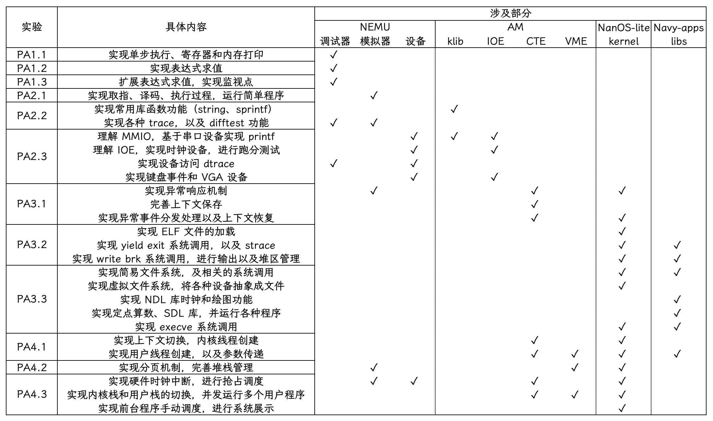
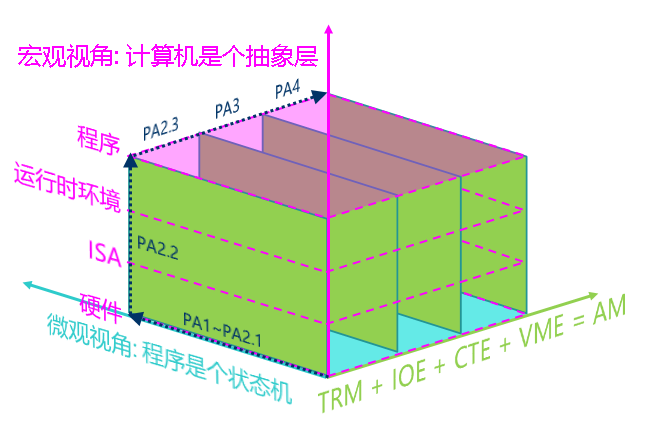
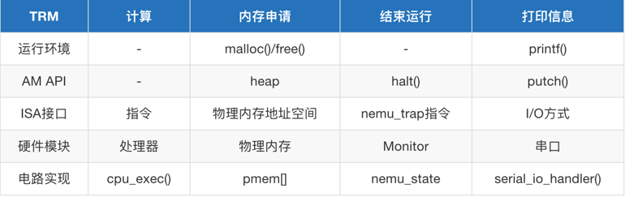

# ICS2023




摘抄自： https://raw.githubusercontent.com/TonyCrane/note/master/docs/cs/system/pa.md
整个实验逐步引导完成一个计算机系统的构建，包括底层的 NEMU 模拟器，运行时环境 AbstractMachine（AM），在其上的简易操作系统 NanOS-lite，以及操作系统上的应用程序库 Navy-apps。
一共分为 5 个部分，PA0 配置环境，PA1 完善 NEMU 的调试器功能，PA2 模拟 NEMU 指令运行以及补充 AM，PA3 完善 NEMU 的中断/异常处理、实现操作系统的系统调用以及简易文件系统功能，PA4 在操作系统中实现多道程序的运行、虚拟内存管理以及外部中断处理。
PS：其中 AM 由五个部分组成，TRM（图灵机模拟）简单而且已经实现好了，IOE 为输入输出扩展，CTE 为上下文管理扩展，VME 为虚拟内存管理扩展，还有一个 MPE（多处理器扩展）在 PA 中不使用。klib 为简单的运行时库，提供给 AM 和操作系统使用。

## PA1

### 最简单的计算机

而这个流传至今的核心思想, 就是"存储程序". 为了表达对图灵的敬仰, 我们也把上面这个最简单的计算机称为"图灵机"(Turing Machine, TRM). 或许你已经听说过"图灵机"这个作为计算模型时的概念, 不过在这里我们只强调作为一个最简单的真实计算机需要满足哪些条件:

+ 结构上, TRM有存储器, 有PC, 有寄存器, 有加法器
+ 工作方式上, TRM不断地重复以下过程: 从PC指示的存储器位置取出指令, 执行指令, 然后更新PC

在nemu中

* 存储器是个在 `nemu/src/memory/paddr.c`中定义的大数组
* PC和通用寄存器都在 `nemu/src/isa/$ISA/include/isa-def.h`中的结构体中定义
* 加法器具体的指令的解码中
* TRM的工作方式通过 `cpu_exec()`和 `exec_once()`体现

### 运行自测

```
bash
make test
```

运行上面的指令会自动读取/test/test.txt中的指令，然后测试sdb的运行

### 遗留问题

+ NEMU中为什么要有nemu_trap? 为什么要有monitor? NEMU中是怎么判断到到nemu_trap的？

## PA2

### PA究竟在做什么?

PA中最重要的两个关于"程序在计算code机上运行"的视角介绍完了:

+ 微观视角: 程序是个状态机，指令的层次精确的描述程序运行的细节，如果类似yemu的系统，完全可以枚举整个状态空间
+ 宏观视角: 计算机是个抽象层，计算机把底层的功能经过层层的抽象分解成最基本的硬件操作，最后以状态机的方式来运行

下面是不同的TRM功能在不同层次上计算机是如何支持的


### 不匹配的函数调用和返回

编译器将f1和f0的返回优化成了尾调用，调用的时候采用的是丢弃返回地址的jump

| 伪指令      | 实际指令                                                           | 意义                               |
| :---------- | :----------------------------------------------------------------- | :--------------------------------- |
| j offset    | jal x0, offset                                                     | 无条件跳转，不存返回地址           |
| jal offset  | jal x1, offset                                                     | 无条件跳转，返回地址存到 x1        |
| jr rs       | jalr x0, 0(rs)                                                     | 无条件跳转到 rs 位置，忽略返回地址 |
| jalr rs     | jalr x1, 0(rs)                                                     | 无条件跳转到 rs 位置，存返回地址   |
| ret         | jalr x0, 0(x1)                                                     | 通过返回地址 x1 返回               |
| call offset | auipc x1, offset[31 : 12] + offset[11]``jalr x1, offset\[11:0](x1) | 远调用                             |
| tail offset | auipc x6, offset[31 : 12] + offset[11]``jalr x0, offset\[11:0](x6) | 忽略返回地址远调用                 |

### 什么是尾调用？
尾调用指的是：
一个函数在返回时，直接返回另一个函数的调用结果，并且在这个调用之后没有其他操作。
例子：

```c
int foo(int n) {
    return bar(n); // 这是尾调用
}
```

这里，foo 的最后一步就是调用 bar 并返回其结果。尾调用优化做了什么？

普通调用：

+ 每次函数调用，都会在栈上分配新的栈帧（保存局部变量、返回地址等）。
+ 递归调用时，栈会不断增长，可能导致栈溢出。

尾调用优化：

+ 如果编译器检测到是尾调用，它会复用当前函数的栈帧，而不是新建一个。
这样，即使递归很深，栈空间也不会增加，避免了栈溢出。

简而言之：

+ 普通递归：每次递归都新建栈帧，栈会变深。
+ 尾递归 + 优化：栈帧被复用，递归不会导致栈变深。

### native测试

我们可以通过在abstract-machine/klib/include/klib.h 中通过定义宏__NATIVE_USE_KLIB__来把库函数链接到klib. 如果不定义这个宏, 库函数将会链接到glibc

## PA3

## 参考文档

+ [ICP PA 实验纪实](https://note.tonycrane.cc/cs/system/pa/)：记录了整个PA的过程
+ [Kinfish am-kernels repo](https://github.com/Kingfish404/am-kernels)：添加了更多的testcase
+ [NOSAE nju pa2](https://www.cnblogs.com/nosae/p/17066439.html#%E5%9F%BA%E7%A1%80%E8%AE%BE%E6%96%BD2) : pa2参考
+ [NJU PA2思路(riscv32)](https://blog.csdn.net/weixin_63603830/article/details/133938389)
+ [PA2报告-HiDark](https://www.cnblogs.com/HiDark/p/17949518)
+ [PA2/3实验报告-常子豪](https://changzihao.github.io/2017/11/03/PA-2-3-%E5%AE%9E%E9%AA%8C%E6%8A%A5%E5%91%8A/)
+ RISC-V 非特权级 ISA : https://note.tonycrane.cc/cs/pl/riscv/unprivileged/
+ https://www.cnblogs.com/nosae/p/17066439.html#%E8%BF%90%E8%A1%8C%E7%AC%AC%E4%B8%80%E4%B8%AA%E5%AE%A2%E6ca%88%B7%E7%A8%8B%E5%BA%8F
+ [Linux 上用xrdp进行远程/orbstack linux machine vnc](https://learn.microsoft.com/zh-tw/azure/virtual-machines/linux/use-remote-desktop?tabs=azure-cli)

## Machine Learning

+ The machine is always right. (机器永远是对的)
  * Corollary: If the program does not produce the desired output, it is the programmer's fault.
+ Every line of untested code is always wrong. (未测试代码永远是错的)
  * Corollary: Mistakes are likely to appear in the "must-be-correct" code.
+ 系统设计的黄金法则 -- KISS法则
  * 这里的KISS是Keep It Simple, Stupid的缩写, 它的中文翻译是: 不要在一开始追求绝对的完美.
  * 唯一可以把你从bug的混沌中拯救出来的就是KISS法则, 它的宗旨是从易到难, 逐步推进, 一次只做一件事, 少做无关的事.
  * 这些教训也让我不断地去思考为什么要用KISS原则。慢慢地我体会到，KISS原则目的其实是——“快速推进、逐步优化”。我们设计一个算法，往往可以在大脑中预先思考好，然后直接编程写出来。但是，我们设计实现一个系统，当系统的复杂度超出我们大脑的工作记忆容量时，就无法在大脑中去“模拟”每一个细节。此时，我们应该用最快的速度去把系统建起了，然后再对各个环节进行优化。 (https://blog.sciencenet.cn/blog-414166-562616.html)
+ 我怕代码写错了啊, 怎么办?
  * 2014年图灵奖得主Michael Stonebraker在一次访谈中提到, 他当时花了5年时间开发了世界上第一个关系数据库系统Ingres, 其中90%的时间用于将它运行起来. 也就是说, 在开发过程中, 有90%的时间系统都是运行不起来的, 是有bug的, 需要调试.
  * 所以, 接受现实吧: 代码出错是很正常的, 你需要从当年程序设计实验里感受到的那种"代码可以一次编译通过成功运行"的幻觉中清醒过来. 重要的是, 我们需要使用正确的方法和工具来帮助我们测试和调试, 最终让程序运行起来. 一个例子是版本控制工具git, 它可以跟踪代码的变化, 从而发现bug是何时引入的, 而且能够在必要的时候回退到上一个程序可以运行的版本.
  * 总之, 只有掌握正确的方法和工具, 才能真正驱散心中对bug的恐惧.
+ 驾驭项目, 而不是被项目驾驭,你毕业后到了工业界或学术界, 就会发现真实的项目也都是这样:
  * 1.刚接触一个新项目, 不知道如何下手
  * 2.RTFM, RTFSC, 大致明白项目组织结构和基本的工作流程
  * 3.运行项目的时候发现有非预期行为(可能是配置错误或环境错误, 可能是和已有项目对接出错, 也可能是项目自身的bug), 然后调试. 在调试过程中, 对这些模块的理解会逐渐变得清晰.
  * 4.哪天需要你在项目中添加一个新功能, 你会发现自己其实可以胜任.
